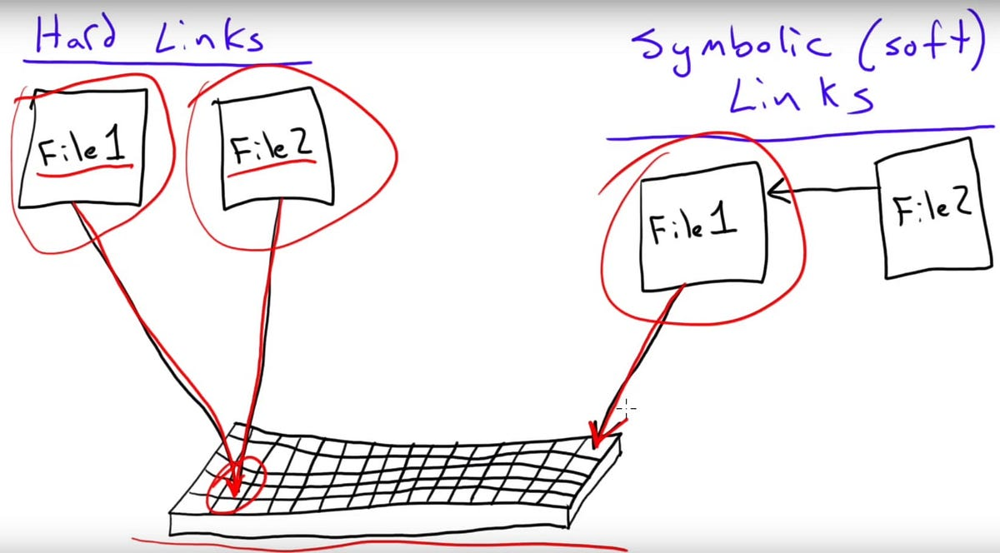
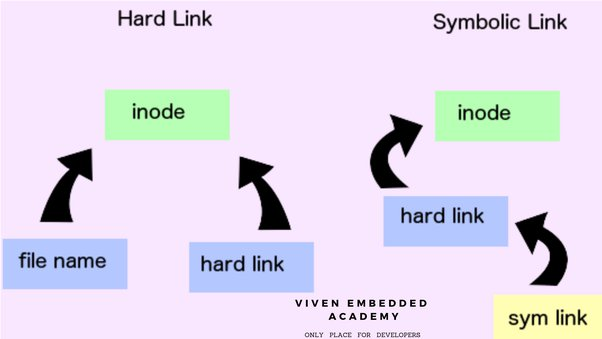

# System Access and File Systems

> Outline :

- [x] Important Things to Remember in Linux
- [x] Access to Linux System
- [x] Access Linux via Putty or SSH command line
- [x] Command Prompts and Getting Prompts Back
- [x] Introduction to Linux File System
- [x] FileSystem Structure and Description
- [x] File System Navigation Commands (cd , ls and pwd)
- [x] Linux File or Directory Properties
- [x] Linux File Types
- [x] What is root?
- [x] Changing Password
- [x] Absolute and Relative Paths
- [x] Creating Files and Directories (touch, cp, vi, mkdir)
- [x] Copying directories
- [x] Finding Files and Directories (find, locate)
- [x] Soft and Hard Links (ln)

---

## Content

### 38. Important Things to Remember in Linux 📝

- **How is Super-user account called Root?**

  - The super-user account in Linux is called `root`. This account has unrestricted access to the entire system.

- **What does Linux Case-sensitive system mean?**

  - Linux is case-sensitive, meaning that `file.txt`, `File.txt`, and `FILE.TXT` are all considered different files.

- **What is the Linux Kernel?**

  - The Linux kernel is the core part of the operating system, managing system resources and hardware communication.

- **Is Linux CLI or GUI?**
  - Linux supports both Command Line Interface (CLI) and Graphical User Interface (GUI). However, many administrative tasks are performed using the CLI.

### 39. Access to Linux System 🔑

- **How To Access To Linux System:**
  - **Console (VGA, HDMI, DVI)**
  - **Remote**
    - **RDP (Windows)**
    - **Sharing (Mac)**
    - **Putty (Linux)**
    - **SSH built-in client**

### 41. Access Linux via Putty or SSH Command Line 🌐

- **How to Access To Linux System:**

  - **Putty:**
    - Download and install Putty from [here](https://www.putty.org).
    - Open Putty, enter the IP address of the Linux machine, and click `Open`.
    - Enter your username and password to log in.
  - **SSH:**

    - Open a terminal on your local machine.
    - Use the command:

      ```bash
      ssh username@hostname
      ```

    - Enter your password to log in.

### 42. Command Prompts and Getting Prompts Back 💻

- **What are Command Prompts?**
  - A command prompt is a text-based interface that allows users to interact with the operating system by typing commands. It typically ends with `$` or `#` (for root user).

### 43. Introduction to Linux File System 🗂️

- **What is a Filesystem?**

  - A filesystem organizes how data is stored and retrieved. Without a filesystem, information placed in a storage medium would be one large body of data with no way to tell where one piece of information stops and the next begins.

- **Make an example: Linux File System**

  - Everything starts from `/`.

- **Make an example: Windows File System**

  - Everything starts from `C:\`.

- **What are different types of filesystem:**
  - **ext3, ext4, btrfs, ntfs, etc.**

### 44. FileSystem Structure and Description 📂

- **Linux File System Structure:**
  - **/boot:** Boot loader files
  - **/root:** The home directory for the root user
  - **/dev:** Device files
  - **/etc:** Configuration files
  - **/bin:** Essential user command binaries
  - **/sbin:** System binaries
  - **/opt:** Optional application software packages
  - **/proc:** Virtual filesystem providing process and kernel information
  - **/lib:** Essential shared libraries and kernel modules
  - **/tmp:** Temporary files
  - **/home:** Users' home directories
  - **/var:** Variable files like logs
  - **/run:** Runtime data
  - **/mnt:** Mount point for temporary mounting filesystems
  - **/media:** Mount point for removable media

### 45. File System Navigation Commands (cd, ls, and pwd) 🌍

- **How to Navigate the File System:**
  - **Common Commands:**
    | Command | Description |
    |-----------|-----------------------------------|
    | `cd` | Change directory |
    | `ls` | List directory contents |
    | `pwd` | Print working directory |
    | `cd ..` | Move up one directory level |
    | `ls -l` | List with detailed information |
    | `ls -a` | List all files, including hidden |

### 46. Linux File or Directory Properties 📑

- **What are Linux file and Directory Properties?**

  - Properties include permissions, ownership, size, and timestamps.

- **What are hard links and How to calculate the number of them?**
  - A hard link is an additional name for an existing file. The `ls -l` command shows the link count in the second column.

### 47. Linux File Types 📜

- **What are Linux file types?**
  - **Table of Linux File Types:**
    | File Type | Symbol | Description |
    |-----------|--------|----------------------------------|
    | Regular | `-` | Standard file |
    | Directory | `d` | Directory |
    | Link | `l` | Symbolic link |
    | Socket | `s` | IPC socket file |
    | Pipe | `p` | Named pipe (FIFO) |
    | Block | `b` | Block device file |
    | Character| `c` | Character device file |

### 48. What is root? 🌲

- **What is Root?**
  - **Root Account:** The super-user account with full access to all commands and files.
  - **Root as `/`:** The top-level directory in the filesystem.
  - **Root Home Directory (`/root`):** The home directory for the root user.

### 49. Changing Password 🔒

- **How to change a password:**

  - **Command:**

    ```bash
    passwd userid
    ```

### 50. Absolute and Relative Paths 🛤️

- **File System Paths:**
  - **Absolute Path:** Full path from the root directory, e.g., `/home/user/file.txt`.
  - **Relative Path:** Path relative to the current directory, e.g., `./file.txt`.

### 51. Creating Files and Directories (touch, cp, vi, mkdir) 🗃️

- **How to use `touch`, `cp`, `vi`, and `mkdir`:**

  - **`touch`:** Create an empty file.

    ```bash
    touch filename.txt
    ```

  - **`cp`:** Copy files or directories.

    ```bash
    cp source.txt destination.txt
    ```

  - **`vi`:** Edit a file with the `vi` text editor.

    ```bash
    vi filename.txt
    ```

  - **`mkdir`:** Create a new directory.

    ```bash
    mkdir new_directory
    ```

### 52. Copying directories 🗂️

- **How to copy Directories:**

  - **Command:**

    ```bash
    cp -r <source> <destination>
    ```

### 53. Finding Files and Directories (find, locate) 🔍

- **How to search in Linux:**
  - **Compare `find` vs `locate`:**
    | Command | Description |
    |---------|----------------------------------------|
    | `find` | Searches in real-time, more flexible |
    | `locate`| Uses a database, faster but requires updatedb|

### 56. Soft and Hard Links (ln) 🔗

- **How to create hard links and soft links:**

  - **Command for Hard Link:**

    ```bash
    ln source.txt hardlink.txt
    ```

  - **Command for Soft Link:**

    ```bash
    ln -s source.txt softlink.txt
    ```

- **Table of comparison between hard link and soft link:**
  | Feature | Hard Link | Soft Link |
  |---------------|------------------------------|------------------------|
  | File Type | Regular file | Symbolic link |
  | Points to | Same inode | Different inode |
  | Broken Link | No, still accessible | Yes, if target deleted |
  | Cross-filesystem | No | Yes |

- **Example:**

  - **Hard Link:**

    ```bash
    ln original.txt hardlink.txt
    ```

  - **Soft Link:**

    ```bash
    ln -s original.txt softlink.txt
    ```

### 54. Using Wildcards in Linux 🌟

Wildcards are special characters that can stand in for other characters in a filename or directory name. They are useful for simplifying commands in the terminal.

- **Common Wildcards:**
  - `*` (Asterisk): Represents zero or more characters.
  - `?` (Question mark): Represents a single character.
  - `[]` (Square brackets): Matches any one of the characters inside the brackets.
  - `{}` (Curly braces): Matches any of the comma-separated patterns inside the braces.

#### Practical Examples

- **Using `*` (Asterisk):**

  ```bash
  ls *.txt
  ```

  - Lists all files ending with `.txt` in the current directory.

- **Using `?` (Question mark):**

  ```bash
  ls file?.txt
  ```

  - Lists files like `file1.txt`, `file2.txt`, etc., but not `file10.txt`.

- **Using `[]` (Square brackets):**

  ```bash
  ls file[123].txt
  ```

  - Lists `file1.txt`, `file2.txt`, and `file3.txt`.

- **Using `{}` (Curly braces):**

  ```bash
  cp {file1,file2}.txt /destination/
  ```

  - Copies `file1.txt` and `file2.txt` to the `/destination/` directory.

### 55. Checking for Malware on Your Linux System 🐧🛡️

If you suspect that your system has been compromised with malware, you can follow these steps to detect and remove it.

#### Step 1: Check Recently Installed Packages 📦

1. **List Recently Installed Packages Using `dpkg` (for Debian-based systems like Ubuntu, Pop!\_OS)**

   ```bash
   grep " install " /var/log/dpkg.log
   ```

2. **List Recently Installed Packages Using `rpm` (for Red Hat-based systems like Fedora, CentOS)**

   ```bash
   grep " install " /var/log/rpm.log
   ```

#### Step 2: Check for Suspicious Processes 🔍

- Use `ps` to list running processes and check for any unfamiliar or suspicious ones.

  ```bash
  ps aux
  ```

#### Step 3: Scan for Malware 🛡️

1. **Install ClamAV:**

   ```bash
   sudo apt-get install clamav
   ```

2. **Update ClamAV Database:**

   ```bash
   sudo freshclam
   ```

3. **Scan the System:**

   ```bash
   sudo clamscan -r /home
   ```

#### Step 4: Remove Malware 🗑️

- If ClamAV detects malware, follow its prompts to quarantine or remove the infected files.

### 56. Soft and Hard Links (ln) 🔗 (continued)

- **How to create hard links and soft links:**

  - **Command for Hard Link:**

    ```bash
    ln source.txt hardlink.txt
    ```

  - **Command for Soft Link:**

    ```bash
    ln -s source.txt softlink.txt
    ```

- **Table of comparison between hard link and soft link:**
  | Feature | Hard Link | Soft Link |
  |---------------|------------------------------|------------------------|
  | File Type | Regular file | Symbolic link |
  | Points to | Same inode | Different inode |
  | Broken Link | No, still accessible | Yes, if target deleted |
  | Cross-filesystem | No | Yes |

- **Example:**

  - **Hard Link:**

    ```bash
    ln original.txt hardlink.txt
    ```

  - **Soft Link:**

    ```bash
    ln -s original.txt softlink.txt
    ```

> MORE IN LINK




---
