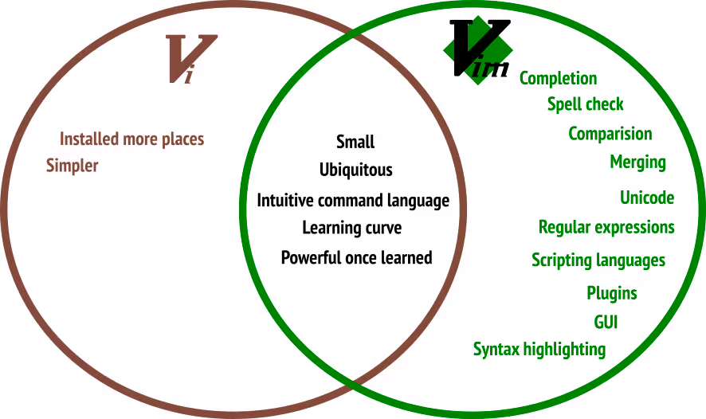

# System Admin

> Outline

- [ ]
- [ ]

---

## Content

### 87. Linux File Editor (vi)

- What is `Vi` Supplies Commands for :
- make a table of most commands with `vi` :

### 88. Difference between vi and vim Editors

- Make a table with

### More

### 89. "sed" Command

- What is `sed` and what are cases for use ?
- Make a table of common of `sed` ?
- Make 3 examples to show to use `sed`?

### 90. User Account Management (useradd, groupadd, usermod, userdel, groupdel)

- What is `User Account Management` Commands and what files is affected?
  - /etc/passwd
  - /etc/group
  - /etc/shadow
- Make a table for each commands with common option
- Make a 5 examples to show they work .

### 91. Enable Password Aging

- What is `Password Aging` ?
- Make a common option with `Password Aging` ?
- Make 3 examples showes `Password Aging` ?

### 92. Switch Users and sudo Access (su, sudo)

- What `Su` and `sudo` ?
- Make a common option with `su` and `sudo` ?
- Make 5 Examples Sceneria for su to how to add user to sudo and make more examples caes

### 93. Monitor Users (who, last, w, id)

- How to Monitor Users ?
- Make a common commands with option to `Monitor Users` ?
- Make 5 Examples on Monitor Users ?

### 94. Talking to Users (users, wall, write)

- How to `Talking` to Users ?
- Make a common Commands with option to `talking Users` ?
- Make 5 Examples on `Talking Users` ?

### 95. Linux Directory Service - Account Authentication

- How to `Account Authentication` ?
- Make a common Commands with `Account Authentication` ?
- Make 5 Examples on `Account Authentication` ?
- What is `LDAP` **(lightweight directory access protocol)**?

### 96. Difference between Active Directory, LDAP, IDM, WinBIND, OpenLDAP

- What is **`Directory Services`** ?
- Make a Compare between Active Directory, LDAP, IDM, WinBIND**(samba)**, OpenLDAP ?

### 97. System Utility Commands (date, uptime, hostname, uname, which, cal, bc)

- What is `System Utility Commands` ?
- Make a table of common System Utility Commands ?
- Make 4 Examples Show How to use Them ?

### 98. Processes, Jobs and Scheduling

- What `Linux Termionlagy` Make a list of them ?
  - Application = Service
  - Script ?
  - Proccess ?
  - Daemon ?
  - Threads ?
  - Job ?
- Proccess / services
  - systemctl or service
  - ps
  - top
  - kill
  - crontab
  - at.

### 99. systemctl command

- What is `Systemctl` ?
- Make a table of common option with `systemctl`?
- Make 3 examples for `Systemctl` ?

### 100. ps command

- What is `ps` ?
- Make a table of common option with `ps` ?
- Make 3 examples for `ps` ?

### 101. top command

- What is `top` ?
- Make a table of common option with `top` ?
- Make 3 Examples for `top` ?

### 102. kill command

- What is `kill` and `killall` and `pkill` ?
- Make a table of common option with `kill` ?
- Make 3 Examples for `kill` ?

### 103. crontab command

- What is `crontab` ?
- make a table of common option with `crontab` ?
- Make 3 exmaples for `kill` ?

### 104. at command

- What is `at` ?
- Make a table of common option with `at` ?
- Make 3 examples for `at`

### 105. Additional cronjobs (hourly, daily, weekly, monthly)

- What is `Cronjobs` ?
- Make a common option with `cronjobs` ?
- Make 3 examples to show `cronjobs` ?
