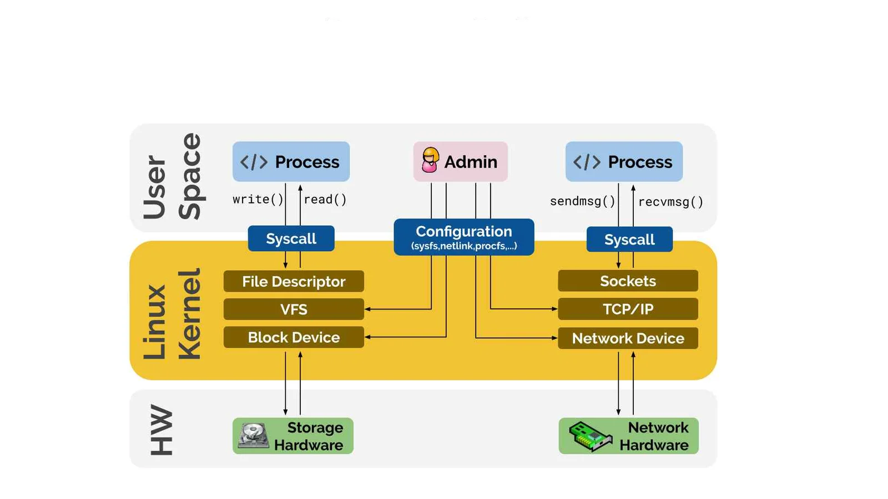

# Shell Scripting

> Outline

- [ ] Linux Kernel
- [ ] What is a Shell?
- [ ] Types of Shells
- [ ] Shell Scripting
- [ ] Basic Shell Scripts

---

## Content

### 122. Linux Kernel

- **What is Kernel?**

  - The kernel is the core component of an operating system. It manages hardware resources, system calls, and communication between software and hardware.

- **A Brief History About Linux Kernel**
  - The Linux kernel was created by Linus Torvalds in 1991. Initially a personal project, it has grown into a widely used open-source kernel, forming the basis of various Linux distributions.

#### More

> Linux Kernel


> Linux System



### 123. What is a Shell?

- **What is `Shell`?**

  - A shell is a command-line interface that provides users with access to the operating system's services. It acts as an intermediary between the user and the kernel/OS, allowing users to execute commands and scripts.
  - Examples of shells include `sh`, `bash`, `zsh`, and others.

- **How to Find Your Shell?**

  - To determine your current shell, use the command:

    ```sh
    echo $0
    ```

  - To view available shells on your system, use:

    ```sh
    cat /etc/shells
    ```

  - To check which shell is assigned to you in the `/etc/passwd` file, use:

    ```sh
    grep $(whoami) /etc/passwd
    ```

- **Other Shells**
  - Windows GUI is a shell.
  - Linux KDE GUI is a shell.
  - Linux shells like `sh` and `bash` are command-line interfaces.

### 124. Types of Shells

- **What are Types of Shells?**

  - Shells come in various types, each with its own features and use cases. Some common types include:

    - **Gnome**: A desktop environment rather than a shell, but often confused with the GNOME Shell, which is a graphical user interface for GNOME.
    - **KDE**: Another desktop environment with its own graphical shell called Plasma.
    - **sh**: The Bourne Shell, one of the earliest Unix shells.
    - **bash**: The Bourne Again Shell, an enhanced version of `sh` with more features.
    - **csh**: The C Shell, which includes C-like syntax.
    - **tcsh**: An enhanced version of `csh` with additional features.
    - **ksh**: The Korn Shell, which incorporates features from both `sh` and `csh`.

- **Comparison Between Shells:**

  | Feature            | `sh`  | `bash`             | `csh`         | `tcsh`         | `ksh`         |
  | ------------------ | ----- | ------------------ | ------------- | -------------- | ------------- |
  | Command Syntax     | Basic | Extended           | C-like        | Enhanced `csh` | Advanced      |
  | Scripting Features | Basic | Advanced           | Limited       | Advanced       | Advanced      |
  | Interactive Use    | Basic | User-friendly      | User-friendly | User-friendly  | User-friendly |
  | Compatibility      | POSIX | POSIX + Extensions | Unix-specific | Unix-specific  | Unix-specific |

### 125. Shell Scripting

- **What is Shell Scripting?**

  - Shell scripting involves writing scripts to automate tasks in a shell environment. These scripts are executed by the shell to perform various operations like file manipulation, program execution, and system monitoring.

- **Guidelines for Writing Shell Scripts:**

  - **Use Comments**: Add comments to explain the purpose and logic of the script.
  - **Error Handling**: Check for errors and handle them appropriately.
  - **Variable Naming**: Use meaningful variable names.
  - **Script Permissions**: Ensure the script has the appropriate execution permissions.
  - **Portability**: Write scripts that are portable across different shell environments if needed.

- **Examples of Shell Scripts:**

  1. **Hello World Script** 📝

     ```sh
     #!/bin/bash
     echo "Hello, World!"
     ```

  2. **File Backup Script** 💾

     ```sh
     #!/bin/bash
     cp /path/to/original_file /path/to/backup_file
     echo "Backup completed successfully."
     ```

  3. **Disk Usage Report Script** 📊

     ```sh
     #!/bin/bash
     df -h > /path/to/disk_usage_report.txt
     echo "Disk usage report generated."
     ```

### 126. Basic Shell Scripts

- Make a 10 Shell Scripts 3 mid level and 7 hard and don't order them use -

### 127. Input and Output of Script

- Make 5 mid level about input and output and make 3 hard level .

### 128. if-then Scripts

- Make 5 mid level about input and output and make 3 hard level .

### 129. for Loop Scripts

- Make 5 mid level about input and output and make 3 hard level .

### 130. do-while Scripts

- Make 5 mid level about input and output and make 3 hard level .

### 131. Case Statement Scripts

- Make 5 mid level about input and output and make 3 hard level .

### 132. Check Remote Servers Connectivity

- Make 5 mid level about input and output and make 3 hard level .

### 133. Aliases (alias)

- Make 5 mid level about input and output and make 3 hard level .

### 134. User and Global Aliases